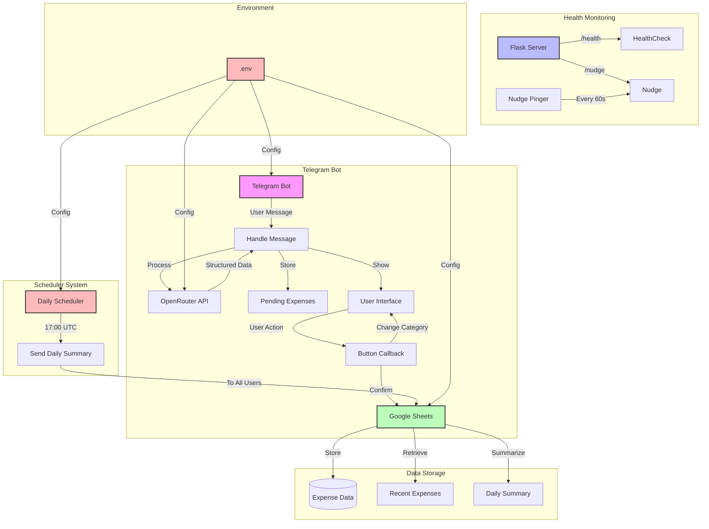

# Telegram Budget Bot

[](https://img.shields.io/badge/coverage-92%25-brightgreen.svg)

A Telegram bot that processes messages and saves them to Google Sheets. This bot can be used to track expenses, notes, or any other structured data that you want to store in a spreadsheet.

## Features
- Receives messages from Telegram
- Processes and transforms message content
- Saves data to Google Sheets
- Configurable message format

## Setup

1. Install dependencies:
```bash
pip install -r requirements.txt
```

2. Set up Google Sheets API:
   - Go to [Google Cloud Console](https://console.cloud.google.com/)
   - Create a new project
   - Enable Google Sheets API
   - Create service account credentials
   - Download the credentials JSON file and save it as `credentials.json` in the project root
   - Share your Google Sheet with the service account email

3. Configure environment variables:
   - Fill in your Telegram Bot Token and Google Sheet ID in `env.variables

4. Run the bot:
```bash
python bot.py
```

## Testing

The project includes a comprehensive test suite. To run tests:

```bash
# Run tests
python -m pytest tests/

# Run tests with coverage reporting
python -m pytest tests/ --cov=. --cov-report=term-missing

# Or use the Makefile
make test
make coverage
```

Coverage reports are generated in multiple formats:
- Terminal output (immediate summary)
- HTML report (htmlcov/index.html)
- XML report (coverage.xml)

## Usage
1. Start a chat with your bot on Telegram
2. Send messages in the configured format
3. The bot will process the message and save it to your Google Sheet

## Configuration
The bot can be configured through the following environment variables:
- `TELEGRAM_BOT_TOKEN`: Your Telegram bot token
- `GOOGLE_SHEET_ID`: ID of your Google Sheet
- `MESSAGE_FORMAT`: Format of messages to process (default: "expense amount category")



This diagram illustrates the main components of the Telegram Budget Bot:

1. **Telegram Bot Core**
   - Handles user messages and interactions
   - Uses OpenRouter API for expense processing
   - Manages pending expenses
   - Provides interactive UI with buttons

2. **Scheduler System**
   - Daily summary scheduler that runs at 17:00 UTC
   - Sends daily expense summaries to all registered users
   - Multi-user support for daily notifications

3. **Health Monitoring**
   - Flask server for health checks
   - Nudge pinger to keep the service alive
   - Runs in a separate thread

4. **Data Storage**
   - Google Sheets integration
   - Stores expense data with timestamps
   - Retrieves recent expenses and generates daily summaries

5. **Environment Configuration**
   - Uses .env file for configuration
   - Manages API keys and credentials
   - Configures all major components
